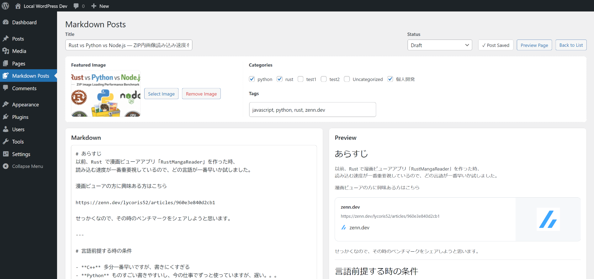

[Jump to English Explanation](#English)

# Zenn Wordpress Markdown ポストエディター

Zenn Wordpress Markdown Post Editor は、Zenn.dev 風の Markdown 編集体験を WordPress 上で再現するための、完全無料のプラグインです。

このプラグインは、WordPress 管理画面の中で Zenn に近い書き心地と表示を実現することを目的にしています。

### 無料で使えます

このプラグインは完全無料です。

- 有料プランなし
- ライセンスキーなし
- 利用制限なし
- サブスクリプション不要

自分の WordPress 環境で自由に利用、改変、管理できます。

### 再現を目指している内容

このプラグインは、Zenn.dev の Markdown 記法や表示スタイルをできるだけ細かく再現することを目指しています。

- コードブロック
- ファイル名付きコードブロック
- diff コードブロック
- シンタックスハイライト
- コードのコピーボタン
- `$$ ... $$` の KaTeX ブロック数式
- `$ ... $` の KaTeX インライン数式
- 脚注
- `~~...~~` の取り消し線
- `<!-- ... -->` の編集用コメント
- Zenn 風 message ブロック
- Zenn 風 details ブロック
- カード型埋め込み
- YouTube 埋め込み
- X 埋め込み
- GitHub ファイル埋め込み
- GitHub Gist 埋め込み

### このプラグインの目的

単に Markdown を WordPress で使えるようにするだけではなく、Zenn.dev に近い執筆体験を WordPress の中で実現することが目的です。

特に、Zenn 独自記法や埋め込み表現を含めて、Zenn に近い感覚で記事を書けることを重視しています。

---

### インストール方法

1. `markdown-post-editor` フォルダを WordPress の `wp-content/plugins/` に配置します。
2. WordPress 管理画面の `プラグイン` を開きます。
3. `Zenn Markdown Post Editor` を有効化します。

ZIP 形式でインストールする場合:

1. `markdown-post-editor` フォルダを zip 化します。
2. WordPress 管理画面で `プラグイン > 新規追加 > プラグインのアップロード` を開きます。
3. zip ファイルをアップロードして有効化します。

---

### 注意

- 使っている Wordpress のテーマによって、記事の表示はうまくいかない場合があります。
- このプラグインは非公式の独立した WordPress プラグインであり、Zenn.dev とは提携していません。
- 一部の埋め込みは、X のウィジェット、GitHub API、favicon 取得など、外部サービスへのアクセスに依存します。
- すべての挙動が完全に Zenn と一致することを保証するものではありませんが、できるだけ細かく近づけることを目指しています。

### 未対応

現在、以下の埋め込みには対応していません。

- CodePen
- SlideShare
- SpeakerDeck
- Docswell
- JSFiddle
- CodeSandbox
- StackBlitz
- Figma
- blueprintUE

また、Mermaid.js のダイアグラムにも対応していません。

---

補足:

- 数式(KaTeX)やコードハイライト用(Shiki)の主要ライブラリーはプラグイン内に同梱されています。外部からライブラリーダウンロードはありません。
- 一部の埋め込み機能は外部サービスへのアクセスに依存します。X.com 埋め込みなど。

---
## English

# Zenn Wordpress Markdown Post Editor

Totally free WordPress plugin that imitates the Zenn.dev style Markdown editing and rendering experience.

## Overview

Zenn Markdown Post Editor is a WordPress plugin for writing posts in a Zenn-like Markdown workflow inside the WordPress admin.

It is designed to reproduce the feel of Zenn.dev as closely as possible while staying inside a self-hosted WordPress environment.

## Free To Use

This plugin is totally free.

- No paid tier
- No license key
- No usage lock
- No subscription requirement

You can use it, modify it, and host it in your own WordPress installation.

## Installation

1. Put the `markdown-post-editor` folder into `wp-content/plugins/` in your WordPress installation.
2. Open `Plugins` in the WordPress admin.
3. Activate `Zenn Markdown Post Editor`.

If you want to install from a zip file:

1. Zip the `markdown-post-editor` folder.
2. In WordPress admin, open `Plugins > Add New > Upload Plugin`.
3. Upload the zip file and activate it.

Notes:

- Core library for math (KaTeX) and code highlighting (Shiki) are already bundled in the plugin.
- Some embed features still depend on external services at runtime.

## What It Tries To Reproduce

This plugin imitates the Zenn.dev style Markdown experience in detail, including:

- fenced code blocks
- code block file headers
- diff code blocks
- syntax highlighting
- copy button for code blocks
- KaTeX block math with `$$ ... $$`
- KaTeX inline math with `$ ... $`
- footnotes
- strikethrough with `~~...~~`
- editor-only HTML comments like `<!-- ... -->`
- Zenn-style message blocks
- Zenn-style details blocks
- card-style embeds
- YouTube embeds
- X embeds
- GitHub file embeds
- GitHub Gist embeds

## Main Goal

The goal is not just “Markdown support”.

The goal is to make WordPress feel close to writing on Zenn.dev, including the custom syntaxes and rich embedded content that are commonly used in Zenn articles.

## Notes

- Depend on the theme used on the wordpress site, this plugin may be working properly.
- This is an independent WordPress plugin and is not affiliated with Zenn.dev.
- Some embeds depend on external services at runtime, such as X widgets, GitHub content APIs, and favicon fetching.
- Rendering may not be 100% identical to Zenn in every edge case, but the plugin aims to imitate the style and authoring flow in detail.

## Not Supported

The following embeds are currently not supported:

- CodePen
- SlideShare
- SpeakerDeck
- Docswell
- JSFiddle
- CodeSandbox
- StackBlitz
- Figma
- blueprintUE

Mermaid.js diagrams are also not supported.

## Files

- Main plugin file: `markdown-post-editor.php`
- Parser: `includes/class-mpe-markdown-parser.php`
- Admin preview logic: `assets/admin.js`
- Embed rendering: `assets/embed-renderer.js`
- Code highlighting: `assets/code-highlighter.js`
- Math rendering: `assets/math-renderer.js`
